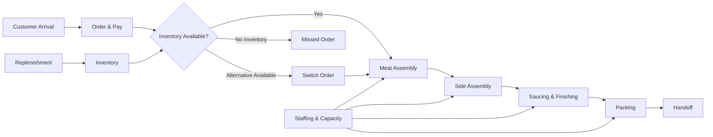
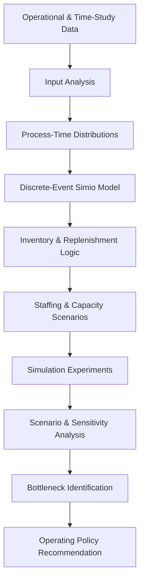

# Operations & Inventory Simulation

<p align="center">
  
  
  
  
</p>

<p align="center">
  <b>Discrete-event simulation and operations optimization project analyzing inventory, replenishment, capacity, staffing, bottlenecks, and service performance.</b>
</p>

<p align="center">
  <a href="#-project-overview">Overview</a> •
  <a href="#-simulation-model">Model</a> •
  <a href="#-key-results">Results</a> •
  <a href="#-scenario-analysis">Scenarios</a> •
  <a href="#-methodology">Methodology</a> •
  <a href="#-tools--techniques">Tools</a>
</p>

> 🎓 **Academic Team Project**  
> NC State University — ISE 562: Simulation Modeling

---

## 🔎 Project Overview

This project uses **Simio discrete-event simulation** to model a multi-stage operating system with finite inventory, replenishment delays, shared resources, queues, and capacity constraints.

The objective was to answer a practical operations question:

> **How should staffing, inventory, replenishment, and process capacity be configured to balance service performance, stockout risk, operating cost, and profitability?**

The model evaluates:

- Staffing and resource allocation
- Inventory availability and stockouts
- Replenishment policies
- Process capacity and queues
- Operational bottlenecks
- Order-to-delivery time
- Customer balking and reneging
- Revenue, operating cost, and profitability

---

## 🏗️ Simulation Model

The Simio model represents the end-to-end operational flow from customer arrival through ordering, preparation, finishing, packing, and handoff.

<p align="center">
  
</p>

<details>
<summary><b>🔍 Click to explore what the model includes</b></summary>

<br>

### Process Flow
- Customer arrival
- Ordering and payment
- Meat assembly
- Side assembly
- Saucing and finishing
- Packing
- Customer handoff

### Inventory Logic
- Finite meat inventory
- Finite side inventory
- Replenishment triggers
- Storage capacity
- Cooking batch quantities
- Stockout behavior
- Order substitution

### Resource Logic
- Customer-service workers
- Food-preparation workers
- Shared worker responsibilities
- Processing capacity
- Queue constraints

### Performance Metrics
- Order-to-delivery time
- Total time in system
- Balked customers
- Reneged customers
- Switched orders
- Revenue
- Labor and food cost
- Expected profit

</details>

---

## 🔄 How the Model Works



---

## 📊 Key Results

| KPI | Recommended Policy |
|---|---:|
| Customer-Service Workers | **2** |
| Food-Preparation Workers | **4** |
| Expected Daily Profit | **$1,707.66** |
| Profit 95% CI | **$1,659.65 – $1,755.67** |
| Average Order-to-Delivery Time | **6.03 min** |
| Final Selected Scenario | **Scenario 187** |

### 💡 Key Operational Finding

> **Downstream food-preparation and replenishment capacity were more important system constraints than simply adding additional order-taking capacity.**

The recommended policy balanced:

`Profitability` • `Service Speed` • `Inventory Availability` • `Staffing Cost` • `Stockout Risk` • `Operational Feasibility`

---

## 🧪 Scenario Analysis

Multiple staffing and capacity configurations were tested to understand operational trade-offs.

<p align="center">
  
</p>

### What-If Comparison

| Scenario | CS Workers | FP Workers | Avg. Daily Profit | Avg. OTD | Avg. Time in System |
|---|---:|---:|---:|---:|---:|
| **Recommended Flexible Policy** | **2** | **4** | **$1,663.24** | **5.92 min** | **14.23 min** |
| Lower Food-Prep Capacity | 2 | 3 | $1,377.74 | 8.18 min | 17.51 min |
| Extra Food-Prep Support | 2 | 5 | $1,448.89 | 5.11 min | 13.00 min |
| Extra Order-Window Capacity | 3 | 4 | $1,366.27 | 6.11 min | 14.46 min |

### ⚡ Cycle-Time Impact

Comparing the recommended flexible configuration with the lower food-preparation-capacity scenario:

**8.18 min → 5.92 min**

### **27.6% improvement in modeled order-to-delivery cycle-time performance**

---

<details>
<summary><b>📌 Why did the recommended configuration perform better?</b></summary>

<br>

Reducing food-preparation workers from **4 to 3** increased congestion and worsened service performance.

Adding a fifth food-preparation worker improved service speed, but the additional labor cost reduced profitability.

Increasing order-taking capacity also did not outperform the recommended configuration because the primary constraints occurred **downstream in preparation, replenishment, and inventory availability**.

This demonstrated that adding resources at the wrong stage does not necessarily improve overall system performance.

</details>

---

## 🎛️ Decision Variables

The simulation evaluated multiple controllable operating parameters.

| Area | Decision Variables |
|---|---|
| 👥 Staffing | Customer-service workers, food-preparation workers |
| 📦 Inventory | Initial pork, brisket, and rib quantities |
| 🔄 Replenishment | Meat, side, and fry replenishment points |
| 🏭 Capacity | Assembly and cabinet capacities |
| 🍳 Production | Stove cooking batch quantities |
| ⏱️ Service | Order-to-delivery and total system time |
| 👤 Customer Outcomes | Balking, reneging, switched orders |
| 💰 Economics | Revenue, labor cost, food cost, profit |

---

## 🧠 Methodology



<details>
<summary><b>📐 Input Modeling & Validation</b></summary>

<br>

Process-time distributions were fitted using **Simio Input Analyzer** and time-study data.

The simulation was also checked against expected operational behavior.

Examples:

| Change | Expected Effect |
|---|---|
| Lower staffing | ↑ Congestion |
| Lower inventory | ↑ Stockouts |
| Greater preparation capacity | ↓ Service delays |
| Poor replenishment timing | ↑ Inventory shortages |

This validation helped ensure that the simulation behaved consistently with the underlying operational system.

</details>

---

## 🎯 Optimization Approach

The model evaluated combinations of:

```text
Staffing
   +
Inventory Levels
   +
Replenishment Points
   +
Process Capacity
   +
Storage Capacity
   +
Batch Quantities
          ↓
   Simulation Experiments
          ↓
 Performance Comparison
          ↓
Recommended Operating Policy
```

The goal was **not simply to maximize one KPI**.

Instead, the analysis evaluated trade-offs among:

- Profit
- Service time
- Labor cost
- Resource utilization
- Inventory availability
- Stockout risk
- Customer outcomes

---

## 🛠️ Tools & Techniques

### Simulation & Optimization
`Simio` `Discrete-Event Simulation` `Scenario Analysis` `Sensitivity Analysis`

### Operations
`Capacity Planning` `Inventory Planning` `Replenishment Analysis` `Bottleneck Analysis` `Resource Allocation`

### Analytics
`Excel` `Time-Study Analysis` `KPI Analysis` `Input Distribution Fitting`

### Decision Support
`What-If Analysis` `Process Optimization` `Cost-Service Trade-offs`

---

## 📁 Repository Structure

```text
operations-inventory-simulation/
│
├── README.md
│
├── assets/
│   ├── model-overview.png
│   └── scenario-results.png
│
├── data/
│   ├── final_recommendation.csv
│   └── what_if_scenarios.csv
│
├── report/
│   └── operations-inventory-simulation-report.pdf
│
└── model/
    └── README.md
```

> **Note:** The full Simio model file is not included in the public repository because of file-size and software-access limitations. Model design and outputs are documented through screenshots, exported results, and the project report.

---

## 📄 Project Report

The full report documents the simulation design, assumptions, input distributions, experiments, optimization analysis, risks, and final recommendation.

👉 **[View Full Project Report](report/operations-inventory-simulation-report.pdf)**

---

## 👥 Team Project

This project was completed as an academic team project for:

**ISE 562 — Simulation Modeling**  
**North Carolina State University**

### Contributors
- Poonam Kunwar
- Wenqi Li
- Asmeret Legesse

---

## 🚀 Future Enhancement

The next enhancement will be an interactive browser-based scenario explorer allowing users to compare:

- Staffing configurations
- Capacity levels
- Cycle time
- Inventory decisions
- Customer outcomes
- Profitability

using the exported Simio experiment results.

<details>
<summary><b>🌐 Interactive Dashboard — Coming Next</b></summary>

<br>

A Streamlit dashboard can be connected to the scenario-output files in `/data` to allow users to explore operating-policy trade-offs interactively.

Once deployed, the live dashboard link can be added here.

</details>

---

## ⭐ Key Takeaway

> **The best operating policy was not the configuration with the most resources. Simulation identified a balanced configuration that aligned downstream capacity, replenishment, inventory availability, service performance, and operating cost.**

---

<p align="center">
  <b>Built with Simio • Operations Research • Process Optimization</b>
</p>
